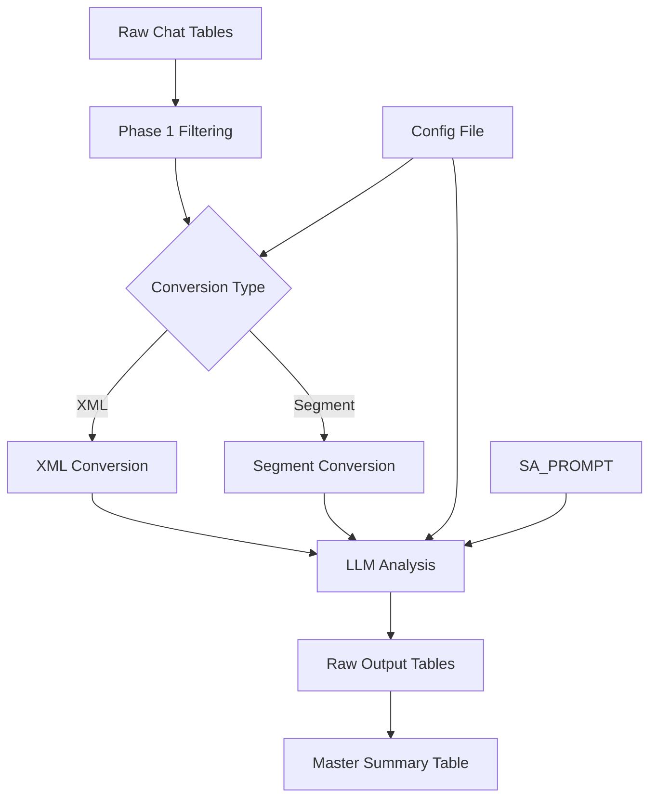

# Snowflake LLM Analysis System

A modular system for analyzing chat conversations using LLM models (OpenAI/Gemini) directly in Snowflake with **multi-path conversion** (XML/Segment) and **standardized SA_PROMPT** for sentiment analysis.

## 🎯 **Current System Overview**

### **Current Department Configuration**
| Department | Prompts | Analysis Type | Conversion Format |
|-----------|---------|---------------|-------------------|
| CC_Resolvers | 1 (SA_prompt) | Sentiment Analysis + NPS | Segment |
| **MV_Resolvers** | **3** (SA + Quality + Accuracy) | **SA + Custom Analysis** | **Segment + XML** |
| Doctors | 1 (SA_prompt) | Sentiment Analysis + NPS | Segment |
| Delighters | 1 (SA_prompt) | Sentiment Analysis + NPS | Segment |
| AT_Filipina | 1 (SA_prompt) | Sentiment Analysis + NPS | Segment |
| AT_African | 1 (SA_prompt) | Sentiment Analysis + NPS | Segment |
| AT_Ethiopian | 1 (SA_prompt) | Sentiment Analysis + NPS | Segment |
| CC_Sales | 1 (SA_prompt) | Sentiment Analysis + NPS | Segment |

All departments use **gpt-4o** with **temperature 0.1** for consistent SA analysis.

## 📝 **SA_PROMPT from prompts.py**

### **System Prompt Source**
The system uses **`SA_PROMPT`** from `prompts.py` as the **system prompt** for all LLM interactions:

```python
# In snowflake_llm_config.py
from prompts import SA_PROMPT

sa_prompt_config = {
    'prompt': "Analyze the following conversation and provide emotional state analysis with NPS scoring.",
    'system_prompt': SA_PROMPT,  # ← The detailed instructions from prompts.py
    'conversion_type': 'segment',
    'model_type': 'openai',
    'model': 'gpt-4o',
    # ... other config
}
```

### **What SA_PROMPT Contains**
The `SA_PROMPT` in `prompts.py` is a comprehensive system prompt that includes:

- **📋 Role Definition**: "You will act as an employee at maids.cc specializing in reading chat conversations..."
- **🎯 Analysis Instructions**: How to detect Frustrated/Neutral/Happy emotional states
- **📊 NPS Scoring Matrix**: Detailed scoring rules based on emotional state transitions
- **⚠️ Edge Cases & Rules**: Special handling for escalations, external factors, bot rejections
- **📝 Output Format**: Required JSON structure for responses
- **💡 Examples**: Multiple conversation examples with correct analysis

### **LLM Interaction Structure**
```
System Prompt: SA_PROMPT (detailed instructions from prompts.py)
    ↓
User Prompt: "Analyze the following conversation and provide emotional state analysis..."
    ↓
Conversation Content: [Segment format BOT conversation]
    ↓
LLM Response: {"Initial Emotional State": "Neutral", "Final Emotional State": "Happy", "NPS_score": 5}
```

## 🤖 **How LLMs are Used in Snowflake**

### **Snowflake LLM Functions**
The system uses **Snowflake's built-in LLM functions** to call external models directly from SQL:

#### **OpenAI Integration**
```sql
-- OpenAI function signature
SELECT openai_chat_system(
    prompt STRING,                    -- Conversation content + analysis instruction
    system_prompt STRING,            -- SA_PROMPT from prompts.py
    model STRING DEFAULT 'gpt-4o-mini',
    temperature FLOAT DEFAULT 0.2,
    max_tokens INT DEFAULT 256
);
```

#### **Gemini Integration** 
```sql
-- Gemini function signature  
SELECT gemini_chat_system(
    prompt STRING,                    -- Conversation content + analysis instruction
    system_prompt STRING,            -- SA_PROMPT from prompts.py
    model STRING DEFAULT 'gemini-1.5-flash',
    temperature FLOAT DEFAULT 0.2,
    max_tokens INT DEFAULT 256
);
```

### **Dynamic Model Selection**
The system chooses the appropriate LLM function based on configuration:

```python
# In snowflake_llm_processor.py
def run_snowflake_llm_analysis(session, conversation_content, prompt_config):
    model_type = prompt_config.get('model_type', 'openai')
    
    if model_type == 'openai':
        # Use openai_chat_system function
        sql_query = f"""
        SELECT openai_chat_system(
            '{combined_prompt}',
            '{system_prompt}', 
            '{model}',
            {temperature},
            {max_tokens}
        ) as llm_response
        """
    elif model_type == 'gemini':
        # Use gemini_chat_system function
        sql_query = f"""
        SELECT gemini_chat_system(
            '{combined_prompt}',
            '{system_prompt}',
            '{model}', 
            {temperature},
            {max_tokens}
        ) as llm_response
        """
```

### **LLM Call Flow**
```
Python Code → SQL Query → Snowflake LLM Function → External API → LLM Response → Python Processing
```

1. **Python builds SQL**: Creates query with conversation content + SA_PROMPT
2. **Snowflake executes**: Calls `openai_chat_system` or `gemini_chat_system` 
3. **External API call**: Snowflake makes HTTP request to OpenAI/Google
4. **LLM processes**: Model analyzes conversation with SA_PROMPT context
5. **Response flows back**: JSON response returned through Snowflake to Python
6. **Storage**: Results saved to raw tables with full traceability

### **Model Configuration Examples**
```python
# Current SA_PROMPT configuration for all departments
'SA_prompt': {
    'prompt': "Analyze the following conversation...",
    'system_prompt': SA_PROMPT,           # From prompts.py
    'conversion_type': 'segment',         # BOT segments only
    'model_type': 'openai',              # Use openai_chat_system
    'model': 'gpt-4o',                   # Specific OpenAI model
    'temperature': 0.1,                  # Low for consistent scoring
    'max_tokens': 512,                   # Enough for JSON response
}

# MV_Resolvers additional prompts use XML + different models
'quality_assessment': {
    'conversion_type': 'xml',            # Full conversation structure
    'model_type': 'openai',              # Use openai_chat_system  
    'model': 'gpt-4o-mini',              # Smaller model for simple analysis
    'temperature': 0.2,
}
```

## 🏗️ System Architecture & Flow

### Overview
The system follows a **Read → Process → Save** pattern with **flexible conversion paths** based on prompt configuration.

```
Snowflake Tables → Multi-Path Conversion (XML/Segment) → LLM Analysis → Raw Tables + Summary
```

### Complete Data Flow



### Step-by-Step Process

1. **📊 Data Loading** (`process_department_phase1`)
   - Reads from existing department chat tables
   - Applies same filtering as existing analytics
   - Returns filtered DataFrame with conversations

2. **🔄 Multi-Path Conversion** (Per-prompt basis)
   - **XML Path**: Structured conversation with hierarchy (`convert_conversations_to_xml_dataframe`)
   - **Segment Path**: Flattened text with agent transitions (`convert_conversations_to_segment_dataframe`)
   - Choice determined by `conversion_type` in prompt configuration

3. **🤖 LLM Analysis** (`analyze_conversations_with_prompt`)
   - Uses **SA_PROMPT** as system prompt (imported from `prompts.py`)
   - Sends conversation content + analysis instruction to Snowflake LLM functions
   - Supports both OpenAI (gpt-4o) and Gemini models
   - Collects responses with full traceability

4. **💾 Data Storage** (`insert_raw_data_with_cleanup`)
   - Saves to unified `SA_ANALYSIS` table (or department-specific tables)
   - Stores conversation content, prompt details, and LLM response
   - Updates master summary table with conversion type tracking
   - Maintains data lineage and metadata

## 📁 File Structure & Responsibilities

### Core Modules

| File | Purpose | Key Functions |
|------|---------|---------------|
| `snowflake_llm_config.py` | Configuration management | Department configs, prompt definitions |
| `snowflake_llm_xml_converter.py` | XML conversion | DataFrame → XML transformation |
| `snowflake_llm_processor.py` | LLM processing | Snowflake LLM function calls |
| `snowflake_llm_orchestrator.py` | Workflow coordination | Multi-department processing |
| `snowflake_llm_integration.py` | Easy-use interface | Simple functions for main file |

### Integration Files

| File | Purpose |
|------|---------|
| `snowflake_llm_main_example.py` | Usage examples and templates |
| `LLM_MODULES_README.md` | General module documentation |
| `SNOWFLAKE_COLUMN_NAMES_UPDATE.md` | Column mapping reference |

## ⚙️ Configuration System

### 1. Department Configuration

**CURRENT CONFIGURATION (Standardized with SA_PROMPT):**

All departments use **SA_PROMPT** for sentiment analysis and NPS scoring:

```python
# In snowflake_llm_config.py
'CC_Resolvers': {
    # Base config (inherited)
    'bot_skills': ['GPT_CC_RESOLVERS'],
    'agent_skills': ['CC_RESOLVERS_AGENTS', 'DDC_AGENTS'],
    'table_name': 'LLM_EVAL.RAW_DATA.CC_CLIENT_CHATS',
    
    # LLM-specific config (standardized)
    'llm_prompts': {
        'SA_prompt': {
            'prompt': "Analyze the following conversation and provide emotional state analysis with NPS scoring.",
            'system_prompt': SA_PROMPT,  # Imported from prompts.py
            'conversion_type': 'segment',  # Uses segment format
            'model_type': 'openai',
            'model': 'gpt-4o',
            'temperature': 0.1,
            'max_tokens': 512,
            'output_table': 'SA_ANALYSIS'
        }
    }
}

# Special case: MV_Resolvers keeps additional prompts
'MV_Resolvers': {
    'llm_prompts': {
        'SA_prompt': {
            # Same SA_PROMPT config as above
        },
        'quality_assessment': {
            'prompt': "Analyze this maid visa resolver conversation...",
            'system_prompt': "You are an expert in maid visa processes...",
            'conversion_type': 'xml',  # Uses XML format
            'model_type': 'openai',
            'model': 'gpt-4o-mini',
            'temperature': 0.2,
            'max_tokens': 300,
            'output_table': 'MV_RESOLVERS_QUALITY_ASSESSMENT'
        },
        'visa_accuracy': {
            'prompt': "Evaluate the accuracy of visa information...",
            'system_prompt': "You are a visa process expert...",
            'conversion_type': 'xml',  # Uses XML format
            'model_type': 'gemini',
            'model': 'gemini-1.5-pro',
            'temperature': 0.1,
            'max_tokens': 400,
            'output_table': 'MV_RESOLVERS_VISA_ACCURACY'
        }
    }
}
```

### 2. Prompt Structure

Each prompt configuration includes:

| Field | Description | Example |
|-------|-------------|---------|
| `prompt` | Main analysis instruction | "Analyze the following conversation..." |
| `system_prompt` | LLM system context (SA_PROMPT) | `SA_PROMPT` from prompts.py |
| `conversion_type` | **NEW**: Conversion format | `'xml'` or `'segment'` |
| `model_type` | Provider choice | `'openai'` or `'gemini'` |
| `model` | Specific model | `'gpt-4o'`, `'gpt-4o-mini'`, `'gemini-1.5-pro'` |
| `temperature` | Creativity control | `0.1` (focused) to `0.9` (creative) |
| `max_tokens` | Response length limit | `256`, `512`, etc. |
| `output_table` | Dedicated storage table | `SA_ANALYSIS`, `DEPT_PROMPT_TYPE` |

### 3. Conversion Types

| Type | Description | Best For | Format |
|------|-------------|----------|---------|
| **`segment`** | Flattened text with agent transitions | SA analysis, workflow tracking | `Consumer: Hello\nBot: Hi\nAgent: Let me help` |
| **`xml`** | Structured conversation hierarchy | General analysis, conversation flow | `<conversation><chatID>123</chatID><content>...</content></conversation>` |

## 📝 Adding New Prompts

### Step 1: Define the Prompt

Add to `get_llm_prompts_config()` in `snowflake_llm_config.py`:

```python
'YOUR_DEPARTMENT': {
    'your_new_prompt': {
        'prompt': """Your analysis instruction here.
        
        Please evaluate:
        1. Specific criteria
        2. Another criteria
        
        Format your response as:
        - Rating: [1-10]/10
        - Explanation: [your reasoning]""",
        
        'system_prompt': "You are an expert in [domain]. Focus on [specific aspects].",
        'model_type': 'openai',  # or 'gemini'
        'model': 'gpt-4o-mini',
        'temperature': 0.2,
        'max_tokens': 400,
        'output_table': 'YOUR_DEPT_YOUR_PROMPT_TYPE'
    }
}
```

### Step 2: Test the Prompt

```python
# Test with single department
from snowflake_llm_integration import test_llm_analysis
result = test_llm_analysis(session, 'YOUR_DEPARTMENT', '2025-07-22')
```

### Step 3: Review Results

```sql
-- Check the output table
SELECT * FROM LLM_EVAL.PUBLIC.YOUR_DEPT_YOUR_PROMPT_TYPE 
WHERE ANALYSIS_DATE = '2025-07-22'
LIMIT 5;
```

## 🏢 Adding New Departments

### Step 1: Add Base Configuration

In `get_snowflake_base_departments_config()`:

```python
'NEW_DEPARTMENT': {
    'bot_skills': ['BOT_SKILL_1', 'BOT_SKILL_2'],
    'agent_skills': ['AGENT_SKILL_1', 'AGENT_SKILL_2'],
    'table_name': 'LLM_EVAL.RAW_DATA.NEW_DEPT_CHATS',
    'skill_filter': 'new_dept_filter',
    'bot_filter': 'bot'
}
```

### Step 2: Add LLM Prompts

In `get_llm_prompts_config()`:

```python
'NEW_DEPARTMENT': {
    'main_analysis': {
        'prompt': "Analyze this [department-specific] conversation...",
        'system_prompt': "You are an expert in [department domain]...",
        'model_type': 'openai',
        'model': 'gpt-4o-mini',
        'temperature': 0.2,
        'max_tokens': 300,
        'output_table': 'NEW_DEPT_MAIN_ANALYSIS'
    }
}
```

### Step 3: Verify Configuration

```python
from snowflake_llm_config import list_all_departments, get_department_prompt_types

print("All departments:", list_all_departments())
print("NEW_DEPARTMENT prompts:", get_department_prompt_types('NEW_DEPARTMENT'))
```

## 🎯 Model Selection Guide

### OpenAI Models
- **`gpt-4o-mini`** - Fast, cost-effective, good for structured analysis
- **`gpt-4o`** - More powerful, better reasoning, higher cost
- **Best for:** Structured analysis, classification, scoring

### Gemini Models  
- **`gemini-1.5-flash`** - Fast, good for creative tasks
- **`gemini-1.5-pro`** - Advanced reasoning, longer context
- **Best for:** Creative evaluation, cultural analysis, complex reasoning

### Parameter Guidelines

| Task Type | Temperature | Max Tokens | Recommended Model |
|-----------|-------------|------------|-------------------|
| Scoring/Rating | 0.1-0.2 | 200-400 | `gpt-4o-mini` |
| Classification | 0.1-0.3 | 100-300 | `gpt-4o-mini` |
| Creative Analysis | 0.3-0.5 | 300-500 | `gemini-1.5-flash` |
| Complex Reasoning | 0.2-0.4 | 400-600 | `gpt-4o` or `gemini-1.5-pro` |

## 📊 Output Tables Structure

### Main Raw Data Table (Unified SA Analysis)
```sql
-- SA_ANALYSIS (Used by all departments for SA_PROMPT)
CREATE TABLE SA_ANALYSIS (
    CONVERSATION_ID VARCHAR,
    DEPARTMENT VARCHAR,
    PROMPT_TYPE VARCHAR,            -- Usually 'SA_prompt'
    CONVERSION_TYPE VARCHAR,        -- 'xml' or 'segment' 
    MODEL_TYPE VARCHAR,             -- 'openai' or 'gemini'
    MODEL_NAME VARCHAR,             -- 'gpt-4o', 'gpt-4o-mini', etc.
    TEMPERATURE FLOAT,
    MAX_TOKENS INTEGER,
    CONVERSATION_CONTENT TEXT,      -- XML or segment format sent to LLM
    LLM_RESPONSE TEXT,              -- SA analysis with NPS scoring
    LAST_SKILL VARCHAR,
    CUSTOMER_NAME VARCHAR,          -- Available from segment format
    AGENT_NAMES VARCHAR,            -- Available from segment format  
    ANALYSIS_DATE DATE,
    PROCESSING_STATUS VARCHAR
);
```

### Department-Specific Tables (MV_Resolvers additional prompts)
```sql
-- Example: MV_RESOLVERS_QUALITY_ASSESSMENT
CREATE TABLE MV_RESOLVERS_QUALITY_ASSESSMENT (
    CONVERSATION_ID VARCHAR,
    DEPARTMENT VARCHAR,
    PROMPT_TYPE VARCHAR,            -- 'quality_assessment'
    CONVERSION_TYPE VARCHAR,        -- 'xml' for MV quality prompts
    MODEL_TYPE VARCHAR,
    MODEL_NAME VARCHAR,
    TEMPERATURE FLOAT,
    MAX_TOKENS INTEGER,
    CONVERSATION_CONTENT TEXT,      -- XML format conversation
    LLM_RESPONSE TEXT,              -- Quality analysis
    LAST_SKILL VARCHAR,
    CUSTOMER_NAME VARCHAR,
    AGENT_NAMES VARCHAR,
    ANALYSIS_DATE DATE,
    PROCESSING_STATUS VARCHAR
);
```

### Master Summary Table (Enhanced)
```sql
-- LLM_EVALS_SUMMARY  
CREATE TABLE LLM_EVALS_SUMMARY (
    Date VARCHAR,
    Department VARCHAR,
    Prompt_Type VARCHAR,
    Conversion_Type VARCHAR,        -- NEW: Track conversion format used
    Model_Type VARCHAR,
    Model_Name VARCHAR,
    Total_Conversations INTEGER,
    Processed_Count INTEGER,
    Failed_Count INTEGER,
    Success_Rate FLOAT,
    Processing_Status VARCHAR,
    Error_Message VARCHAR,
    Analysis_Date DATE
);
```

## 🚀 Usage Examples

### Basic Usage
```python
from snowflake_llm_integration import run_llm_analysis

def main(session):
    # Run complete analysis for all departments
    result = run_llm_analysis(session, '2025-07-22')
    return result['pipeline_summary']
```

### Testing & Validation
```python
from snowflake_llm_integration import validate_llm_setup, test_llm_analysis

def main(session):
    # Step 1: Validate dependencies
    if validate_llm_setup(session)['overall_status'] != 'SUCCESS':
        return "❌ Setup validation failed"
    
    # Step 2: Test SA_PROMPT analysis on different departments
    cc_result = test_llm_analysis(session, 'CC_Resolvers')      # 1 prompt (SA_prompt)
    mv_result = test_llm_analysis(session, 'MV_Resolvers')      # 3 prompts (SA + quality + accuracy)
    doctors_result = test_llm_analysis(session, 'Doctors')     # 1 prompt (SA_prompt)
    
    return f"CC: {'✅' if cc_result['success'] else '❌'}, MV: {'✅' if mv_result['success'] else '❌'}, Doctors: {'✅' if doctors_result['success'] else '❌'}"
```

### Single Department Analysis
```python
from snowflake_llm_orchestrator import analyze_llm_single_department

def main(session):
    # Focus on one department
    result = analyze_llm_single_department(session, 'Doctors', '2025-07-22')
    return result['summary'] if result['success'] else f"Error: {result['error']}"
```

### Custom Analysis
```python
def main(session):
    # Process specific departments only
    target_departments = ['CC_Resolvers', 'Doctors']
    results = []
    
    for dept in target_departments:
        result = analyze_llm_single_department(session, dept, '2025-07-22')
        results.append(f"{dept}: {'✅' if result['success'] else '❌'}")
    
    return f"Custom analysis results:\n" + "\n".join(results)
```

## 🛠️ Troubleshooting

### Common Issues

**"LLM function not found"**
```sql
-- Check if functions exist
SHOW FUNCTIONS LIKE '%chat_system%';
```

**"No conversations converted to XML"**
- Check if department skills match data
- Verify bot/consumer message filtering
- Check date range has data

**"Table creation failed"**
```sql
-- Ensure schema exists
CREATE SCHEMA IF NOT EXISTS LLM_EVAL.PUBLIC;
```

### Debug Functions

```python
# Check system status
from snowflake_llm_integration import check_llm_status
status = check_llm_status(session)
print(status['status_summary'])

# Validate configuration
from snowflake_llm_config import list_all_departments, list_all_output_tables
print("Departments:", list_all_departments())
print("Output tables:", list_all_output_tables())
```
